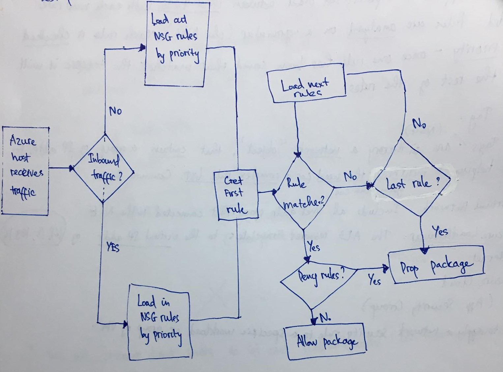

### Network Security Groups
Network Security Groups (NSG) hoạt động như một tưởng lửa ảo để filter traffic truy cập đến các tài nguyên trong Azure (inbound) và đi ra bên ngoài từ các tài nguyên đó(outbound).  

NSG chứa các quy tắc bảo mật sẽ cho phép (allow) hoặc từ chối (deny) traffic inbound và outbound. Một quy tắc bao gồm các thuộc tính như

|Thuộc tính | Giải thích|
|---|---|
|Name|Unique trong NSG|
|Priority|Xác định rule này sẽ được đánh giá trước hay sau rule khác|
|Action|Deny hay Allow|
|Source or Destination|Bất kỳ (*), một IP duy nhất (8.8.8.8) hoặc CIDR block (10.0.0.0/24)|
|Port range|Có thể là 1 cổng duy nhất 80 (HTTP) hoặc 1 dải (8000 - 8003)|
|Direction|Xác định rule sẽ được áp dụng lên inbound hay outbound|
|Protocol|TCP, UDP, ICMP, ...|

Các quy tắc trong NSG được đánh giá theo thứ tự dựa theo thuộc tính Priority, tiếp đến sử dụng 5 thông tin cơ bản sau như một 5-tuple đó là (source, source port, destination, destination port, and protocol) để đánh giá traffic đó có khớp (match) với rule đang được xem xét hay không từ đó sẽ allow hoặc deny traffic này.

Về cơ bản việc define 1 rule trong NSG khá đơn giản. Tuy nhiên, trong thực tế sẽ có nhiều trường hợp khi tạo deny rule yêu cầu phải deny một traffic cụ thể nào đó truy cập tài nguyên nhưng kết quả là traffic này vẫn được phép truy cập vào tài nguyên bên trong Azure có thể do traffic này cũng match với 1 allow rule có priority cao hơn 

Ví dụ: traffic có IP là 8.8.8.8 muốn truy cập vào tài nguyên Blob Storage và deny rule từ chối tất cả traffic có source từ CIDR 8.8.8.0/24 truy cập mọi tài nguyên trong Azure, nhưng 1 allow rule khác lại có priority cao hơn cho phép tất cả source từ IP 8.8.8.8 và port 443 truy cập vào tài nguyên Blob Storage.

Lúc này, để từ chối truy cập từ traffic trên có thể tăng priority của deny rule đó lên, nhưng điều này có thể dẫn đến phá vỡ các rule khác chẳng hạn có 1 allow rule khác cho phép source 8.8.8.10 truy cập SQL Server Database trong Azure và nhiều trường hợp tương tự nữa.

Tất nhiên đây chỉ là 1 dump case (chỉ mang tính chất ví dụ) tuy nhiên khi số lượng rules trở nên nhiều hơn, số lượng vnet, subnet cũng nhiều hơn sẽ dễ dẫn đến những trường hợp tương tự. Để giảm rủi ro đó và thuận tiện khi thêm các rule khác vào sau cần có 1 chiến lược khởi tạo các rule ngay từ những rule đầu tiên.

Trước hết cần hiểu rõ về hoạt động của NSG thực hiện các rules khi có yêu cầu traffic đến hoặc đi như thế nào.

### Network Security Groups hoạt động như thế nào

{:class="img-responsive"}

Đầu tiên, Azure nhận được traffic xác xác định xem nó là inbound hay outbound để từ đó sẽ load các rules tương ứng theo thứ tự ưu tiên (nếu là inbound sẽ load các rules trong Inbound NSG rules và ngược lại).

Sau đó nó sẽ lấy ra rule đầu tiên (Do Tập các rules này khi load ra đã được sắp xếp theo thứ tự ưu tiên rồi nên nó là cái ưu tiên cao nhất). Tại đây nó kiểm tra xem traffic đó có khớp với rule hay không. Nếu khớp kiểm tra action của rule (Deny -> Loại bỏ gói tin này, Allow -> Cho phép gói tin đi qua NSG).

Trường hợp không khớp nó sẽ tiếp tục lấy ra rule tiếp theo và thực hiện lại các bước trên cho tới khi không còn rule nào nữa thì sẽ loại bỏ gói tin. Như vậy một khi rule có ưu tiên cao hơn khớp với traffic thì nó sẽ thực thi action (deny hay allow) luôn và không kiểm tra các rule còn lại nữa.

### Ghi chú khi tạo rule trong NSG
Trừ khi có một lý do cụ thể, tốt nhất chỉ nên liên kết NSG với subnet hoặc NIC thay vì cả hai.Vì các quy tắc trong NSG được liên kết với subnet có thể xung đột với các quy tắc trong NSG được liên kết với NIC.

Nếu cần cả hai cả 2 thì có ghi chú 1 và 2 cần nhớ

#### Thứ tự đánh priority cho rule khi apply cho NIC (network interface card) và subnet
Thường có 2 option đó là
* Đánh priority của NIC cao hơn của subnet với cùng 1 loại rule đối với cả inbound và outbound
* Đánh priority của NIC cao hơn của subnet với cùng 1 loại rule đối với inbound và thấp hơn đối với outbound (inboud->subnet->NIC, outbound->NIC->subnet)

Quan trọng, thống nhất chọn 1 option đối với mọi rules điều này giúp ích ở chỗ nếu sau 1 rule không thấy được thực thi không mất công mất sức tra xem nó có bị ảnh hưởng do rule apply cho NICs hay subnets hay không mà có thể phán đoán ngay theo option đã đặt từ đầu. 

#### Tạo 1 NSG cho tất cả vnet hoặc subnet và có thể sử dụng nhiều NSG cho 1 vnet/subnet.
Không nhất thiết phải tạo 1 NSG cho 1 subnet/vnet mà có thể dùng chung 1 NSG cho nhiều NICs/subnets/vnets (NSG thì có giới hạn giới hạn số lượng nhưng mặc định 200 thông thường ko chạm tới).

Điều này tránh việc cứ phải vào tạo 1 rule cho nhiều NSG cho các NICs/subnets khác nhau khi dùng 1 NSG trên 1 NICs.

Tuy nhiên, nếu muốn thêm 1 rule vào 1 số subnet nhưng không muốn apply trên toàn bộ các subnet thì sao? 

Giải pháp là sử dụng nhiều NSG cho 1 vnet/subnet. NSG1 thì vẫn apply cho toàn bộ subnet còn rule thêm vào 1 số subnet khác có thể đặt trong NSG2 (Cần xem xét thứ tự đặt NSG1 và NSG2 nữa bị chặn ở NSG1 là ko vào được NSG2 nếu theo thứ tự NSG1->NSG2)

#### Đặt tên có ý nghĩa cho từng rule
Tránh đặt tên kiểu này RULE-12345 (Không hiểu để làm gì luôn!)

#### Khi không thể kết nối tới tài nguyên bên trong Azure 
Kiểm tra NSG trước tiên (Hì hục check logs resource lại mất công vì không thấy request nào tới)

#### Thực hiện phân tích một cách chi tiết trước khi đánh priority cho rule
Cái này hiển nhiên rồi, ghi lại cho nhớ

#### Sử dụng NSG Flow Logging
Tính năng mới trong Azure network watcher hiển thị luồng của inbound và outbound traffic trên mỗi rule (JSON format) -> Tra fee xem có free hay cost như thế nào?

#### ...