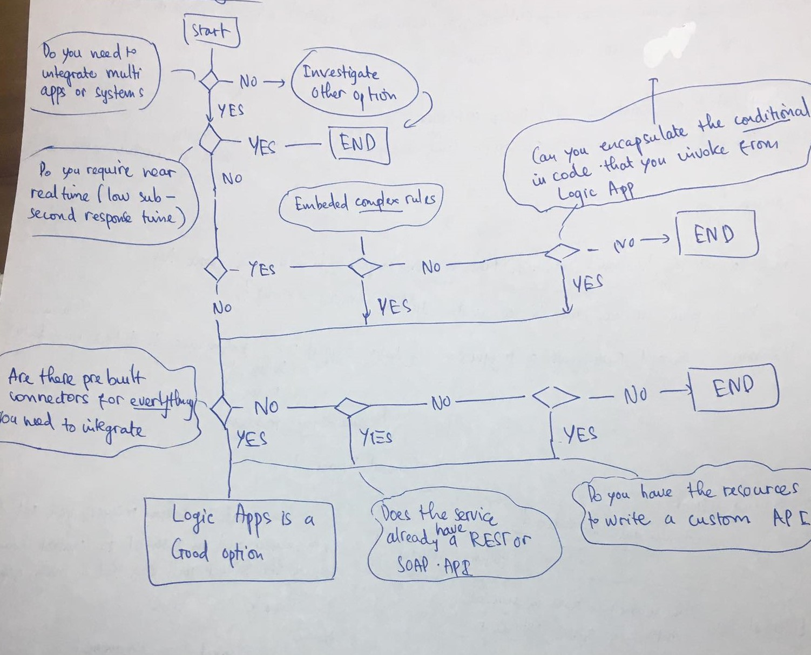
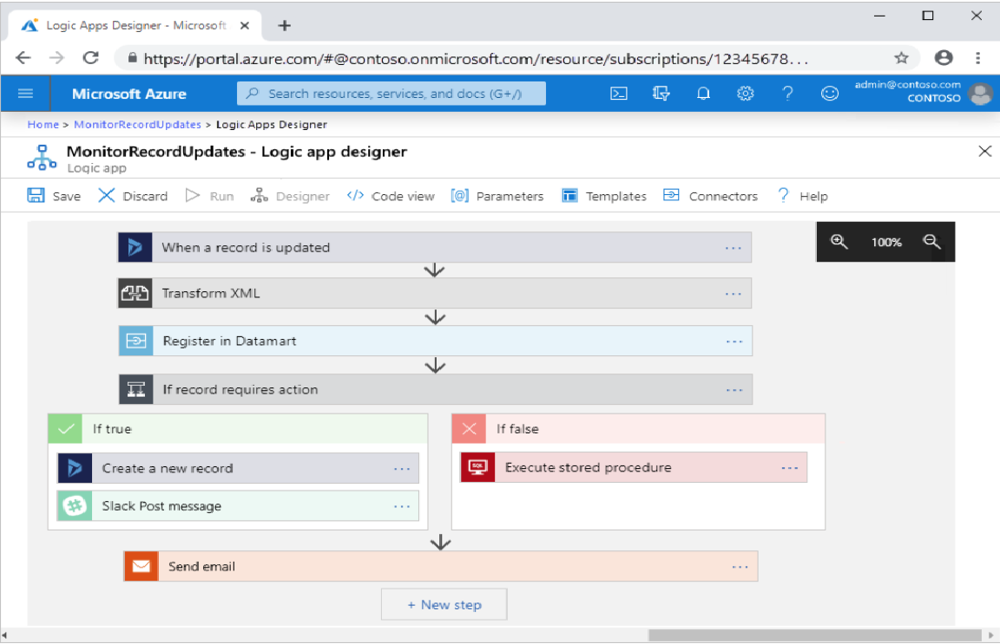

### Azure Logic App là gì?
Azure Logic App là một phần của Azure Integration Services (các dịch vụ tích hợp trong Azure bao gồm các dịch vụ liên quan tới APIs, Workflows, Messages và Events). Azure Logic App thuộc nhóm Workflows đóng vai trò điều phối (orchestrate) quy trình công việc (workflow) khi bạn cần tích hợp ứng dụng hay tích hợp dữ liệu, dịch vụ giữa các doanh nghiệp hoặc tổ chức.

Logic App được sinh ra để đơn giản hóa cách bạn thiết kế và xây dựng các giải pháp tích hợp trên thông qua giao diện đồ họa (GUI) và mô hình Designer-first (declarative).

Để làm được điều này các kỹ sư Azure đã phải dày công phát triển một công cụ có tên gọi là Azure Logic App Designer giúp bạn có thể hoàn thành nó trên iPad hoặc iPhone. Bạn sẽ xử dụng công cụ này và thực hiện sắp xếp lại các thành phần nối tiếp nhau bằng chuột hoặc cảm ứng trên màn hình. Việc còn lại là của Logic App Designer, nó sẽ gửi bản thiết kế định nghĩa quy trình công việc mà bạn vừa soạn đến Logic App execution engine và khởi chạy ứng dụng của bạn mỗi khi điều kiện hoạt động được kích hoạt (điều kiện này được gọi là trigger).

### Khi nào thì nên dùng Logic App?
Azure Logic App không phải lúc nào cũng phù hợp với mọi ngữ cảnh. Chẳng hạn nếu nền tảng bạn phát triển cần 1 trong 3 tiêu chí sau đây thì Azure Logic App không phải là lựa chọn tốt nhất:
* Yêu cầu hoạt động real-time. Mặc dù tốc độ phản hồi, thực thi có Azure App Logic cũng rất nhanh tuy nhiên nó chưa thể đạt tới ngưỡng real time được.

* Các luật lệ từ quy trình nghiệp vụ quá phức tạp. Do Logic App được xây dựng theo mô hình Designer-first (declarative) nên rõ ràng khi các luật lệ trở nên quá phức tạp, lồng ghép nhau quá nhiều nó sẽ không thực sự hiệu quả bằng mô hình Code-first (imperative).

* Sử dụng các dịch vụ non-standard chưa được chuẩn hóa trên Logic App. Logic App mới chỉ hỗ trợ khoảng hơn 200 dịch vụ khác nhau chủ yếu là các dịch vụ phổ biến được sử dụng rộng rãi được chia làm 4 nhóm (nhóm các dịch vụ lưu trữ Storage(Dropbox, Saleforce), nhóm dịch vụ Processing(SAP, Azure Functions), nhóm dịch vụ Social (Facebook, Youtube, Twitter), nhóm dịch vụ Communication(Office, Slack)) nên dịch vụ tích hợp của bạn có thể không được hỗ trợ sẵn thông qua các bản pre-built connector. Bạn hoàn toàn có thể tạo ra 1 custom connector giúp dịch vụ của bạn có thể hoạt động trên Logic App tuy nhiên cần xem xét tới chi phi làm việc đó so với việc làm theo cách truyền thống để có giải pháp hiệu quả nhất.

Ngoài ra khi lựa chọn cần xem xét 4 tiêu chí và thực hiện so sánh với cách làm truyền thống.
1. Mức độ tích hợp Integration (Tích hợp càng nhiều dịch vụ bên ngoài thì Logic App tỏ ra càng hiệu quả so với cách truyền thống. Nếu không có sự kết nối nào ra dịch vụ bên ngoài thì Logic App không phải là lựa chọn tối ưu)
2. Hiệu năng Performance (Azure Logic App không phù hợp với yêu cầu real time nhưng nó có thể xử lý 1 lượng lớn data bằng paralled process)
3. Điều kiện (Nếu điều kiện đơn giản hoặc phức tạp quá đều không phù hợp vs Azure Logic App)
4. Connector (Nếu có sẵn pre-built connector thì rất perfect nhưng nếu không có sẵn bạn có thể custom connector cho riêng mình tuy nhiên cần xem xét chi phí công sức bỏ ra)

Khi quyết định sẽ xem xét Azure Logic App là cách tiếp cận hãy follow theo chỉ dẫn dưới đây để xem liệu Azure Logic App có thỏa mãn với requirements hay không?

{:class="img-responsive"}

### Logic App hoạt động như thế nào?
Logic App được xây dựng dựa trên sắp xếp các connectors.

Một connector là một thành phần cung cấp một giao diện (interface) tới dịch vụ bên ngoài.

Quy trình công việc có thể được xây dựng từ rất nhiều loại tác vụ khác nhau. Do đó ý tưởng của Logic App đó là xử dụng các thuật ngữ trigger, action và control action trong concept của mình.

* Trigger là sự kiện mà tập hợp các điều kiện cụ thể của nó được thỏa mãn.

* Action là thao tác xử lý để thực thi một nhiệm vụ trong quy trình nghiệp vụ.

* Mỗi connector thực chất là một thùng chứa (container) cho những triggers và actions liên quan trong nó. Chẳng hạn Dropbox Connector chứa 2 triggers đó là new file created và a file is modified và có các actions như create file (thêm file mới), list file in folder, delete file, ...

* Trigger và action có thể được coi là những hàm quan trọng gọi đến các API bên dưới mà dịch vụ ngoài đó cung cấp thông qua các connector.

* Ngoài ra Logic App cung cấp thêm control action đây là một action đặc biệt được xây dựng sẵn cho Logic App để kiểm soát luồng như if ... else, switch, foreach và loop

Một Workflow có thể được xử lý bởi Logic App thông qua công cụ Logic App Designer có thể được mô tảtả như hình dưới đây

{:class="img-responsive"}

Đầu tiên, mỗi khi có 1 bản ghi được update thì "When a record í updated" trigger sẽ chuyển output của nó (là thông tin bản ghi) xuống action bên dưới.

Action Tranform XML sẽ nhận output của trigger (thông tin bản ghi) làm parameter để xử lý và trả ra output là thông tin bản ghi ở dạng XML và trả xuống action bên dưới.

Cứ output của thành phần phía trên sẽ là input của thành phần ngay phía dưới nó.

Sau đó Register in Datamart sẽ nhận xml ở trên và xử lý theo yêu cầu nào đó trước khi insert nó vào data warehouse và trả ra bản ghi đã được insert.

Control Action rẽ nhánh if...else sẽ kiểm tra điều kiện dựa trên bảng ghi ở trên và rẽ nhánh action xử lý ở phía dưới.
Nếu true tạo thêm 1 bản ghi mới và gửi tin nhắn qua slack.

Nếu false thực hiện stored procedure.
