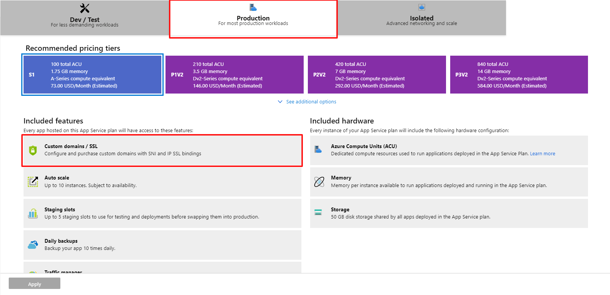
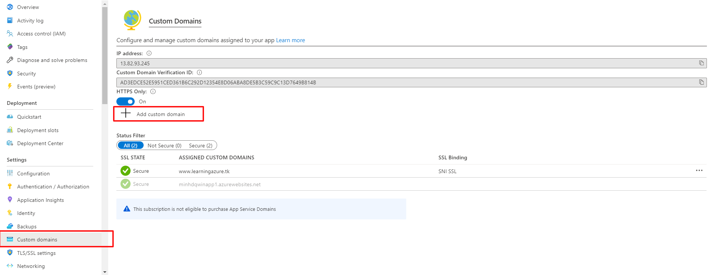
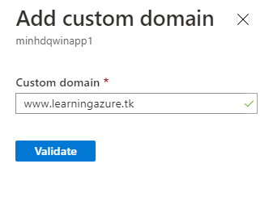
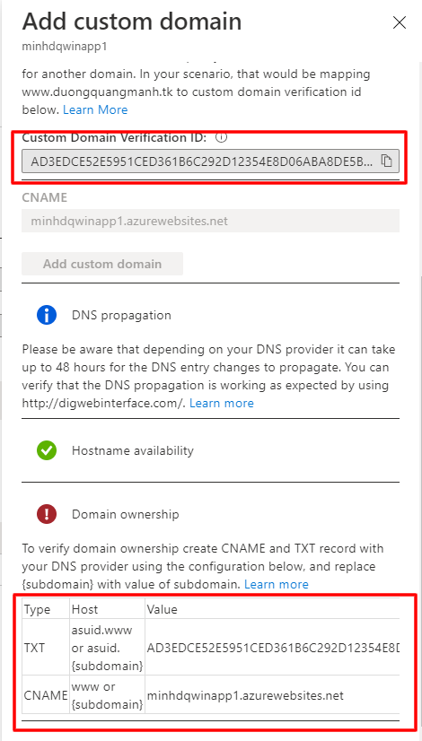
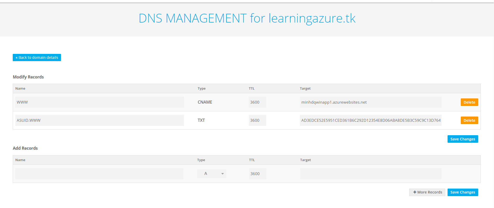
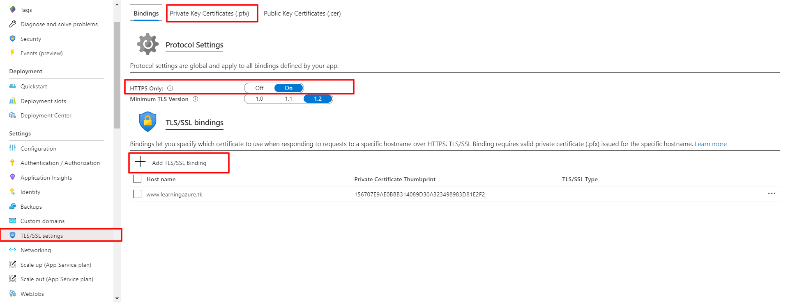
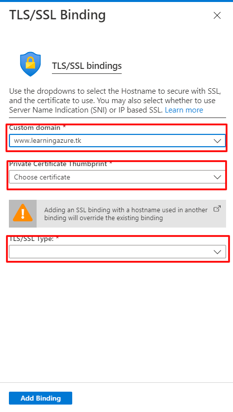

### Azure App Service là gì?

Azure App Service là dịch vụ dựa trên HTTP để hosting các ứng dụng web, REST APIs và mobile back ends.

Azure App Service là một PaaS (Platform as a Service) điều đó có nghĩa bạn chỉ cần tập trung vào websites của mình, 
các API và logic xung quanh nó trong khi Azure sẽ xử lý hạ tầng (infrastructure) bên dưới để chạy và mở rộng
ứng dụng khi cần, tăng cường bảo mật, cân bằng tải, auto-scaling và quản lý tự động.

Azure App Service giúp bạn nhanh chóng triển khai ứng dụng của mình được phát triển bằng các ngôn ngữ phổ biến như: .NET, 
.NET Core, Java, Ruby, PHP, Node.js hoặc Python. Ngoài ra bạn cũng có thể tận dụng các tính năng tích hợp trong Azure App Service 
như Azure DevOps để triển khai CI/CD hay custom domain và setting TLS/SSL trong nháy mắt.

### Kích hoạt custom domain

Khi hosting ứng dụng lên Azure App Service, ứng dụng đó sẽ có một domain có dạng {app-name}.azurewebsites.net

Tuy nhiên khi deploy lên môi trường production, bạn sẽ cần sử dụng một custom domain của mình thay cho domain từ 
Azure App Service. Do vậy khi lựa chọn App Service Plan dành cho môi trường production Azure App Service sẽ offer 
thêm tính năng Custom domains/ SSL.

{:class="img-responsive"}

Để kích hoạt custom domain bạn phải lựa chọn App Service Plan for production. Sau đó vào App Service và chọn Custom domains -> Add custom domain

{:class="img-responsive"}

Tiếp đến nhập custom domain có thể là {sub-domain}.mydomain.com như là www.mydomain.com hoặc nake domain (wildcard domain)
như là mydomain.com và ấn nút validate.

{:class="img-responsive"}

Nếu domain hợp lệ, bạn cần thêm thông tin Custom Domain Verification ID vào DNS provider (nhà cung cấp dịch vụ tên miền như 
GoDaddy, Freenom, ...) để xác thực quyền sở hữu domain. Bạn chỉ cần lấy các thông tin chỉ dẫn từ Azure và truy cập vào dịch vụ 
quản lý tên miền để setting các thông tin này là được. Chẳng hạn bạn cần add thông tin này vào tên miền www.learningazure.tk của nhà 
cung cấp tên miền Freenom.

Type|Host|Value
TXT|asuid.www|AD3EDCE52E5951CED361B6C292D12354E8D06ABA8DE5B3C59C9C13D7649B814B
CNAME|www|minhdqwinapp1.azurewebsites.net

{:class="img-responsive"}

Quay lại trang quản lý tên miền Freenom và add các thông tin trên

{:class="img-responsive"}

### Setting TLS/SSL cho custom domain
Cuối cùng là setting TLS/SSL cho custom domain trên.
Đầu tiên là đi tới TLS/SSL settings và chọn Add TLS/SSL Binding. Tuy nhiên khi thực hiện binding TLS\SSL vào custom domain yêu cầu 
bạn cần có Private Key Certificates. Azure cho phép bạn import hoặc tự động genrate một App Service Certificates mới. Do vậy, nếu chưa 
có Private Key Certificates bạn có thể click Private Key Certificates và tạo mới 1 Certificates.

{:class="img-responsive"}

Sau khi ấn Add TLS/SSL Binding bạn sẽ cần chọn custom domain đã add vào App Service ở trên để thực hiện binding TLS\SSL và 
Private Key Certificates đã tạo mới hoặc import vào App Service thông qua Private Key Certificates. Tiếp đến là lựa chọn kiểu TLS\SSL

{:class="img-responsive"}

Có 2 kiểu TLS\SSL đó là 
* SNI (Server Name Indication) cho phép nhiều chứng chỉ TLS\SSL bảo mật cho nhiều domain trên cùng một địa chỉ IP. Đa số các trình duyệt 
đều support SNI.

* IP SSL - cho phép một chứng chỉ TLS\SSL bảo mật cho một địa chỉ public IP cụ thể. Và yêu cầu thực hiện remap record cho IP SSL trong quản 
lý tên miền. Chẳng hạn remap một CNAME record: 
SNI.WWW.mydomain.com -> IP address
