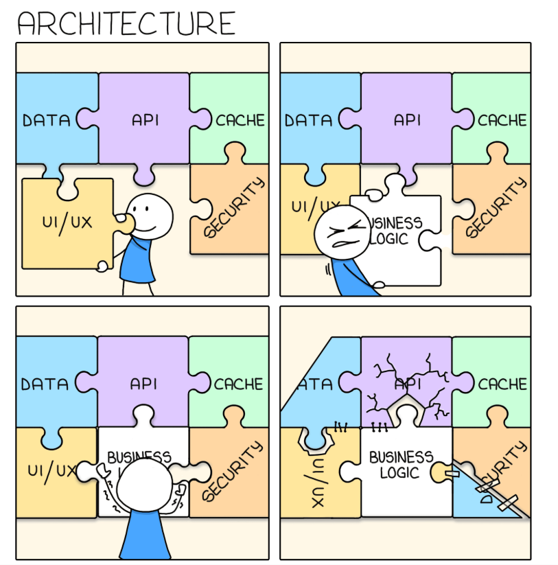

## Microsoft Cloud Adoption Framework
Microsoft Cloud Adoption Framework (viết tắt là CAF) là một bộ sưu tập các tài liệu, hướng dẫn triển khai, best practices và các công cụ đã được Microsoft thiết kế hoặc chứng minh giúp bạn thực hiện các chiến lược kinh doanh và công nghệ cần thiết trong quá trình chuyển đổi lên cloud.

Microsoft Azure là nền tảng điện toán đám mây đang được thiết lập và sử dụng bởi 95% các công ty thuộc nhóm Fortune 500 (500 công ty lớn nhất Hoa Kỳ theo tổng doanh thu mỗi công ty được biên soạn hàng năm bởi tạp chí Fortune) cùng với sự hiểu biết sâu sắc của Microsoft đối với khối doanh nghiệp sẽ cung cấp cho bạn rất nhiều kinh nghiệm để tăng tốc trong hành trình lên cloud của mình.

Việc triển khai services trên cloud rất rất khác biệt so với triển khai services tại chỗ (on-premises) từ việc chuyển đổi chi phí từ CapEx sang OpEx, IT resources để vận hành các services đó cho tới các vấn đề về dữ liệu như tính pháp lý và rủi ro an toàn dữ liệu tại mỗi quốc gia trên thế giới liên quan tới security và compliance và privacy và nhiều vấn đề khác nữa.

Tuy nhiên, những lợi ích mà cloud mang lại cũng rất lớn nên có rất nhiều doanh nghiệp lớn và nhỏ cũng đang và đã chuyển đổi từ on-premises sang cloud. Việc chuyển đổi này không thực hiện đồng loạt tất cả các services của các doanh nghiệp đó đang nắm giữ mà đội cloud strategy và cloud design architect sẽ xem xét thực hiện chuyển đổi lên cloud trước một số dịch vụ có thể về compliance hay security hay storage hoặc computing tùy thuộc và business insights và business strategy của công ty đó. Do vậy, CAF là tham khảo rất quan trọng đối với các cloud strategy bởi nó đến từ kinh nghiệm được chia sẻ từ rất nhiều các công ty đi trước trong việc chuyển đổi lên cloud và được Microsoft kiểm chứng.

https://docs.microsoft.com/en-us/azure/cloud-adoption-framework/

## Các giai đoạn của Cloud Adoption lifecycle
 

{:class="img-responsive"}

### 1. Define strategy
Tài liệu hóa chiến lược đám mây sẽ giúp các bên liên quan của doanh nghiệp và kỹ thuật viên hiểu được những lợi ích mà tổ chức đang theo đuổi bằng cách áp dụng đám mây.

{:class="img-responsive"}

Tại giai đoạn này, Agile Project Management với sự hiểu biết về business logic và Lead Architect cần lên chiến lược giải pháp phù hợp tránh việc bức tranh solution architecture sau khi được lắp giáp xong trở nên đứt gãy. Sau đó họ cùng với toàn bộ team Solution Architect sẽ thực verify chiến lược và tài liệu hóa chiến lược đám mây này, đây là tài liệu quan trọng trong việc định hướng chiến lược xây dựng, phát triển và vận hành xuống toàn bộ các bên liên quan. Tài liệu càng rõ ràng và củng cố được những lợi ích mà tổ chức đang theo đuổi trên hành trình lên mây thì các kỹ thuật viên càng nắm bắt tốt và triển khai thành công.

Bốn yếu tố quan trọng cần xem xét và làm rõ tại giai đoạn này gồm có

* Hiểu rõ về động cơ (Motivations) cần lên mây.
* Kết quả kinh doanh (Business outcomes)
* Cơ sở lý luận kinh doanh (Business justification)
* Prioritize Project hay MVP (Minimum Viable Product)

 

|Motivations | Business outcomes|Business justification| Prioritize Project|
|---|---|---|---|
|• Executive mandate |• Fiscal: revenue, cost, profit|• Business case: the cloud is not always cheaper, mirroring is not cloud, servers drive cost analysis |• Business criteria: workload supported by a BDM|
|• Merger and acquisitions |• Agility: timer to market provisioning |• Financial model: Capex/Opex, ROI, gain, cost avoidance/reduction|• Technical criteria: minimum dependencies and test path, no governance|
|• Cost savings |• Reach: global access, sovereignty |• Cloud accounting: cost center, procurement, profit center, revenue generating, chargeback|• Qualitative analysis: Current Team analysis|
|• Optimization |• Customer engagement: cycle time || |
|• Agility |• Performance: SLAs, Downtime, operations reliability|||
|• Market demands ||||
|• Migration  ||||
|• Innovation ||||

 

### 2. Plan
Lên kế hoạch áp dụng chiến lược cloud và chuyển đổi các mục tiêu mong muốn của chiến lược thành các hành động. Nó sẽ giúp các nỗ lực về kỹ thuật phù hợp với chiến lược kinh doanh.

Tại giai đoạn này, Agile Project Management và Lead Architect cùng Solution Architect team vẫn tiếp tục là người lên kế hoạch hành động.

### 3. Ready
Thiết lập nền tảng đám mây cho tổ chức hoặc doanh nghiệp do team vận hành cloud cùng với Solution Architect team thiết lập.

### 4. Adopt: Migrate
Adopt gồm 2 giai đoạn đó là Migrate (Chuyển đổi) và Innovate (Đổi mới)

Việc áp dụng đám mây sẽ bao gồm khối lượng công việc không đảm bảo đầu tư đáng kể vào việc tạo ra logic kinh doanh mới. Những khối lượng công việc này là những ứng cử viên cho việc di chuyển sang đám mây

### 4. Adopt: Innovate
Các ứng dụng cũ hơn có thể tận dụng nhiều lợi ích tương tự trên nền tảng đám mây bằng cách hiện đại hóa giải pháp hoặc các thành phần của giải pháp. Azure DevOps là một ví dụ, Azure DevOps tham gia vào các quy trình để tạo ra các vòng phản hồi ngắn hơn và trải nghiệm khách hàng tốt hơn.

### 5. Govern
Định nghĩa chính sách (polocies) đảm bảo tính nhất quán. Sự phù hợp với các yêu cầu quản trị/tuân thủ là chìa khóa để duy trì môi trường đám mây chéo được quản lý tốt.

### 6. Manage
Quản lý và vận hành sẽ liệt kê, triển khai và đánh giá lặp đi lặp lại liên quan đến hành vi hoạt động dự kiến của dịch vụ.

## Những vấn đề khi lên cloud
Việc chuyển đổi lên cloud hiện nay, đặc biệt là ở Việt Nam còn đang gặp nhiều khó khăn dẫn đến quá trình chuyển đổi diễn ra còn chậm. Một số lý do có thể dễ dàng nhận thấy đó là

1. Mặc dù Azure hiện đang có số lượng regions đặt datacenter đang là lớn nhất tuy nhiên hiện tại không có data center nào đặt tại lãnh thổ của Việt Nam cũng như nhiều QG khác trên thế giới nên với những ứng dụng yêu cầu tính availability cao tại những khu vực này đòi hỏi cần xem xét và giải quyết nhiều bài toán liên quan tới tính liên tục và xử lý gián đoạn do đường truyền kém ổn định. 

2. Vấn đề tuân thủ quy định về luật cư trú dữ liệu và quyền riêng tư tại mỗi quốc gia khác nhau và ngày càng ngặt nghèo dẫn đến sự phức tạp khi lựa chọn giải pháp cho ứng dụng có tính global. Cũng như phải giải quyết nhiều vấn đề về compliance và privacy.

3. IT resources còn tương đối hạn chế. Sự hạn chế này đến từ cả con người với yêu cầu hiểu biết và vận hành tốt services trên cloud và các quy trình (các quy trình trước đây thường tối ưu cho mô hình CapEx và on-premises rất khác biệt so với mô hình OpEx và cloud).

4. Giới quản lý chưa nhận thức được hết những cơ hội và lợi thế khi chuyển đổi lên cloud nên còn chậm trễ và chưa quyết liệt trong việc chuyển đổi.

5. Vấn đề Security khi lên cloud có nhiều khác biệt so với on-premises
 

## Đo lường thành công trên cloud

Khi đưa services lên cloud ngoài việc verify lại các vấn đề về security, bugs phát sinh, ... Bạn có thể đo lường thành công việc chuyển đổi lên cloud thông qua các factors sau:
* Khả năng vận hành liên tục
* Tiết kiệm chi phí
* Khả năng mở rộng (Scalable)
* Tốc độ
* Tính linh hoạt (Flexibility)
* Tiết kiệm nguồn lực hoạt động

