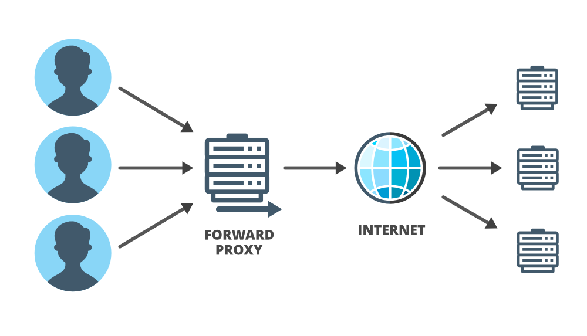
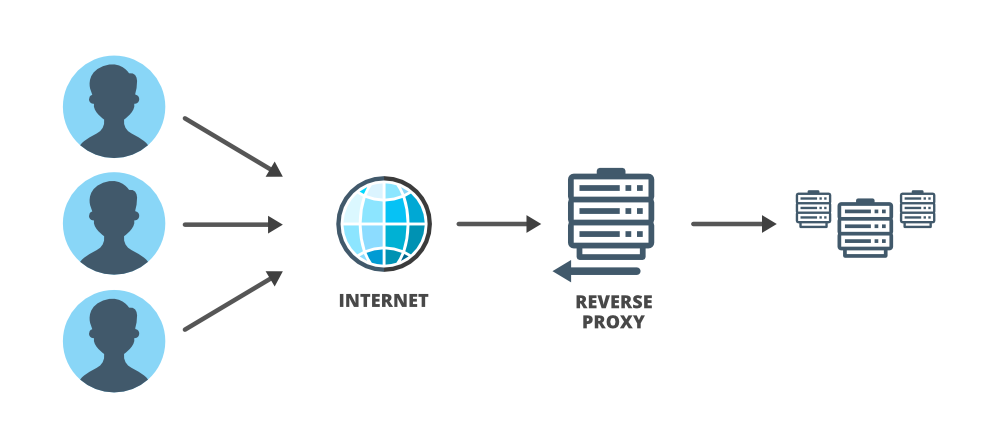

## 5 system design concepts phổ biến để chuẩn bị cho interview
**Bài dịch từ** 

[https://www.geeksforgeeks.org/5-common-system-design-concepts-for-interview-preparation/](https://www.geeksforgeeks.org/5-common-system-design-concepts-for-interview-preparation/)

Trong cuộc phỏng vấn kỹ thuật phần mềm, vòng thiết kế hệ thống đã trở thành một phần tiêu chuẩn của cuộc phỏng vấn. Mục đích chính của vòng này là kiểm tra khả năng xây dựng một hệ thống phức tạp và quy mô lớn của ứng viên. Do thiếu kinh nghiệm trong việc xây dựng một hệ thống quy mô lớn nên rất nhiều kỹ sư phải vật lộn với vòng này.

Bạn có thể có các cuộc trò chuyện khác nhau với những người phỏng vấn khác nhau cho cùng một câu hỏi. Tuy nhiên do tính chất mở của vòng này, thường sẽ không có câu trả lời chính xác tuyệt đối và tiêu chuẩn cho các vấn đề về thiết kế. Bạn sẽ cần mở rộng câu trả lời dựa trên kiến thức và hiểu biết về kiến ​​trúc toàn của bộ hệ thống và cách bạn gắn kết chúng lại với nhau cùng với tư duy giải quyết vấn đề và xử lý tình huống. Do vậy sẽ rất cần thiết nếu bạn biết một số khái niệm quan trọng về vòng thiết kế hệ thống trước khi bắt đầu chuẩn bị cho một số câu hỏi cụ thể. Chúng ta sẽ trình bày một số khái niệm cơ bản về thiết kế hệ thống để xây dựng nền tảng vững chắc cho các câu hỏi trong vòng này thông qua 5 concepts phổ biến nhất của system design interview

### 1. Cân bằng tải (Load Balancing)
Trong một hệ thống , một máy chủ có một lượng công suất nhất định để xử lý tải hoặc yêu cầu từ người dùng. Nếu một máy chủ nhận được nhiều yêu cầu đồng thời nhiều hơn dung lượng của nó thì thông lượng của máy chủ bị giảm và nó có thể chậm lại. Ngoài ra, nó có thể bị lỗi (không có sẵn) nếu nó tiếp tục trong một thời gian dài hơn. Bạn có thể thêm nhiều máy chủ hơn (chia tỷ lệ ngang) và giải quyết vấn đề này bằng cách phân phối số lượng yêu cầu giữa các máy chủ này. Bây giờ câu hỏi đặt ra là ai sẽ nắm quyền sở hữu việc phân phối yêu cầu và cân bằng tải. Ai sẽ quyết định yêu cầu nào nên được phân bổ cho máy chủ nào để giảm bớt gánh nặng của một máy chủ duy nhất? Ở đây có vai trò của bộ cân bằng tải. 

Công việc của bộ cân bằng tải là phân phối lưu lượng truy cập đến nhiều máy chủ khác nhau để trợ giúp về thông lượng, hiệu suất, độ trễ và khả năng mở rộng. Bạn có thể đặt bộ cân bằng tải trước các máy khách (nó cũng có thể được chèn vào những nơi khác) và sau đó bộ cân bằng tải sẽ định tuyến yêu cầu đến trên nhiều máy chủ web. Tóm lại, bộ cân bằng tải là người quản lý lưu lượng và họ chịu trách nhiệm về tính khả dụng và thông lượng của hệ thống. Nginx, Cisco, TP-Link, Barracuda, Citrix, Elastic Load Balancing from AWS… đây là một số công cụ cân bằng tải phổ biến hiện có trên thị trường

### 2. Bộ nhớ đệm (Caching)
Chúng ta đã nói về tải trên các máy chủ trong phần cân bằng tải nhưng một điều bạn cần biết là máy chủ web của bạn thường không phải là máy chủ đầu tiên gặp sự cố, trên thực tế, máy chủ cơ sở dữ liệu của bạn có thể bị overload trước vì có rất nhiều thao tác đọc/ghi trên đó và các phép toán điều này làm chậm hiệu suất của hệ thống. Để xử lý các truy vấn này và cải thiện hiệu suất của các thao tac đọc/ghi dữ liệu thì bộ nhớ đệm là kỹ thuật tốt nhất nên sử dụng. 

Truy cập dữ liệu từ bộ nhớ chính (RAM) nhanh hơn truy cập dữ liệu từ bộ nhớ phụ (đĩa). Bằng cách sử dụng kỹ thuật bộ nhớ đệm, bạn có thể tăng tốc hiệu suất của hệ thống. 

Nếu bạn thường xuyên truy cập và sử dụng dựa vào một phần dữ liệu nào đó thì hãy lưu dữ liệu vào bộ nhớ đệm và truy xuất dữ liệu đó một cách nhanh chóng từ bộ nhớ đệm chứ không phải trên đĩa. Quá trình này làm giảm khối lượng công việc trên các máy chủ phụ trợ. Bộ nhớ đệm giúp giảm bớt các kết nối tới cơ sở dữ liệu. Một số dịch vụ bộ nhớ đệm phổ biến là Memcache, Redis và Cassandra.

Cùng với đó rất nhiều trang web sử dụng CDN (mạng phân phối nội dung), một mạng toàn cầu gồm các máy chủ. CDN lưu trữ các tệp nội dung tĩnh như hình ảnh, javascript, HTML hoặc CSS và nó giúp người dùng truy cập rất nhanh. Bạn có thể chèn bộ nhớ đệm vào máy khách (ví dụ: lưu trữ trình duyệt), giữa máy khách và máy chủ (ví dụ: CDN) hoặc trên chính máy chủ.

### 3. Proxy

Thông thường, máy chủ proxy là một số đoạn code (thuộc về phần mềm trung gian) hoặc phần cứng nằm giữa máy khách và máy chủ khác. Nó có thể nằm trên máy tính cục bộ của người dùng hoặc bất cứ nơi nào giữa máy khách và máy chủ đích. Máy chủ proxy nhận yêu cầu từ máy khách và truyền nó đến máy chủ gốc, sau đó nó chuyển tiếp phản hồi nhận được từ máy chủ tới máy khách khởi tạo. Trong một số trường hợp, khi máy chủ nhận được yêu cầu, địa chỉ IP không được liên kết với máy khách mà là của máy chủ proxy. Điều này xảy ra khi máy chủ proxy ẩn danh tính của máy khách. 

Nói chung, khi mọi người sử dụng thuật ngữ proxy, họ đề cập đến 'proxy chuyển tiếp' hay 'Forward proxy'. 'Forward proxy' được thiết kế để trợ giúp người dùng, nó sẽ hoạt động thay mặt cho máy khách trong tương tác giữa máy khách và máy chủ. Nó chuyển tiếp các yêu cầu của người dùng và hoạt động như một đại diện cá nhân của người dùng. Trong thiết kế hệ thống, nhất là trong các hệ thống phức tạp, proxy rất hữu ích đặc biệt là 'proxy ngược' hay 'Reverse Proxy'. 'Reverse Proxy' ngược lại với 'proxy chuyển tiếp'. Một Reverse Proxy hoạt động thay mặt cho một máy chủ và nó được thiết kế để trợ giúp các máy chủ. 

Một Reverse Proxy có thể được giao rất nhiều nhiệm vụ để trợ giúp máy chủ chính và nó có thể hoạt động như một người gác cổng, một bộ sàng lọc, một bộ cân bằng tải và một trợ lý toàn diện.

Forward Proxy

{:class="img-responsive"}

Reverse Proxy

{:class="img-responsive"}

### 4. Định lý CAP
CAP là viết tắt của tính nhất quán (Consistency), tính khả dụng (Availability) và dung sai phân vùng (Partition tolerance)

Định lý nói rằng bạn không thể đạt được tất cả các thuộc tính ở mức tốt nhất trong một cơ sở dữ liệu duy nhất, vì có sự cân bằng tự nhiên giữa các mục. Bạn chỉ có thể chọn hai trong số ba cùng một lúc và điều đó hoàn toàn phụ thuộc vào mức độ ưu tiên dựa trên yêu cầu của bạn. Ví dụ: nếu hệ thống của bạn cần phải có sẵn và khả năng phân vùng, thì bạn phải sẵn sàng chấp nhận một số độ trễ trong các yêu cầu nhất quán của mình.  Cơ sở dữ liệu quan hệ truyền thống là một sự phù hợp tự nhiên cho phía CA trong khi các công cụ cơ sở dữ liệu không quan hệ hầu hết đáp ứng các yêu cầu AP và CP

* Nhất quán có nghĩa là bất kỳ yêu cầu đọc nào cũng sẽ trả về trạng thái của lần ghi gần đây nhất. Tính nhất quán dữ liệu thường là "mạnh" (Strong) đối với cơ sở dữ liệu SQL và đối với cơ sở dữ liệu NoSQL, tính nhất quán có thể là bất kỳ thứ gì từ "ngẫu nhiên" (eventual) đến "mạnh" (strong)

* Tính khả dụng có nghĩa là một nút phải phản hồi trong một khoảng thời gian cho phép. Không phải mọi ứng dụng đều cần chạy 24/7 với độ khả dụng 99,999% nhưng nhiều khả năng bạn sẽ thích cơ sở dữ liệu có tính khả dụng cao hơn

* Dung sai phân vùng có nghĩa là hệ thống sẽ tiếp tục hoạt động bất chấp lỗi mạng hoặc nút

{:class="img-responsive"}

### 5. Cơ sở dữ liệu

Trong các cuộc phỏng vấn thiết kế hệ thống, không có gì lạ khi bạn được yêu cầu thiết kế lược đồ cơ sở dữ liệu về những bảng nào bạn có thể đang sử dụng? khóa chính sẽ trông như thế nào và các chỉ số của bạn là gì. Bạn cũng cần chọn các loại giải pháp lưu trữ khác nhau (quan hệ hoặc không quan hệ) được thiết kế cho các trường hợp sử dụng khác nhau. Chúng ta sẽ thảo luận về một số khái niệm quan trọng về cơ sở dữ liệu thường được sử dụng trong thiết kế hệ thống.

* Lập chỉ mục cơ sở dữ liệu: Chỉ mục cơ sở dữ liệu thường là một cấu trúc dữ liệu hỗ trợ việc tìm kiếm cơ sở dữ liệu nhanh chóng..nhưng làm thế nào? chúng ta hãy hiểu với một ví dụ. Giả sử bạn có một bảng cơ sở dữ liệu với 200 triệu hàng và bảng này được sử dụng để tra cứu một hoặc hai giá trị trong mỗi bản ghi. Bây giờ nếu bạn cần truy xuất một giá trị từ một hàng cụ thể thì bạn cần phải lặp lại bảng, đây có thể là một quá trình tốn thời gian, đặc biệt nếu đó là bản ghi cuối cùng trong bảng. Chúng tôi có thể sử dụng lập chỉ mục cho những loại vấn đề này. 
Về cơ bản lập chỉ mục là cách sắp xếp một số bản ghi trên nhiều trường. Khi bạn thêm chỉ mục trong bảng trên một trường, nó sẽ tạo ra một cấu trúc dữ liệu khác chứa giá trị trường và một con trỏ tới bản ghi mà nó liên quan. Cấu trúc chỉ mục này sau đó được sắp xếp, cho phép thực hiện các tìm kiếm nhị phân trên đó. Nếu bạn có 200 triệu bản ghi trong một bảng có tên và tuổi và bạn muốn truy xuất danh sách những người thuộc một nhóm tuổi, thì bạn cần thêm chỉ mục về thuộc tính tuổi vào cơ sở dữ liệu

* Nhân rộng: Điều gì sẽ xảy ra nếu cơ sở dữ liệu của bạn xử lý bị quá tải? Nó sẽ bị treo tại một thời điểm nhất định và toàn bộ hệ thống của bạn sẽ ngừng hoạt động vì tất cả các yêu cầu phụ thuộc vào dữ liệu trong máy chủ. Để tránh loại lỗi này, chúng tôi sử dụng sao chép đơn giản có nghĩa là sao chép cơ sở dữ liệu của bạn (chính) và chỉ cho phép đọc hoạt động trên các bản sao (nô lệ) này của cơ sở dữ liệu của bạn. Nhân rộng giải quyết vấn đề về tính khả dụng trong hệ thống của bạn và đảm bảo tính dự phòng trong cơ sở dữ liệu nếu một sự cố. Bạn đã tạo bản sao (nô lệ) của cơ sở dữ liệu của mình nhưng bạn sẽ lấy dữ liệu từ cơ sở dữ liệu gốc (chính) như thế nào? bạn sẽ đồng bộ hóa dữ liệu trên các bản sao như thế nào, vì chúng có cùng một dữ liệu? 
Bạn có thể chọn cách tiếp cận đồng bộ (cùng lúc với những thay đổi đối với cơ sở dữ liệu chính) hoặc cách tiếp cận không đồng bộ tùy thuộc vào nhu cầu của bạn. Nếu nó không đồng bộ thì bạn có thể phải chấp nhận một số dữ liệu không nhất quán vì những thay đổi trong cơ sở dữ liệu chính có thể không phản ánh trong slave trước khi nó gặp sự cố. Nếu bạn cần trạng thái giữa hai cơ sở dữ liệu phải nhất quán thì việc nhân rộng cần phải nhanh chóng và bạn có thể đi theo phương pháp đồng bộ. Bạn cũng cần đảm bảo rằng nếu thao tác ghi vào bản sao không thành công, thì thao tác ghi vào cơ sở dữ liệu chính cũng không thành công (tính nguyên tử)

* Phân vùng dữ liệu hoặc phân vùng dữ liệu: Sao chép dữ liệu giải quyết được vấn đề về tính khả dụng nhưng nó không giải quyết được các vấn đề về thông lượng và độ trễ (tốc độ). Trong những trường hợp đó, bạn cần phải chia nhỏ cơ sở dữ liệu của mình, đơn giản có nghĩa là 'chia nhỏ' hoặc phân vùng các bản ghi dữ liệu của bạn và lưu trữ các bản ghi đó trên nhiều máy. Vì vậy, dữ liệu sharding sẽ phá vỡ cơ sở dữ liệu khổng lồ của bạn thành các cơ sở dữ liệu nhỏ hơn. Lấy ví dụ về twitter nơi mà rất nhiều lần ghi được thực hiện. Để xử lý trường hợp này, bạn có thể sử dụng tính năng phân chia cơ sở dữ liệu nơi bạn chia cơ sở dữ liệu thành nhiều cơ sở dữ liệu chính. 
Chủ yếu có hai cách để chia nhỏ cơ sở dữ liệu của bạn - làm sắc nét ngang và làm sắc nét dọc. Trong phương pháp mài thẳng đứng, bạn lấy từng bàn và đặt từng bàn vào một máy mới. Vì vậy, nếu bạn có một bảng người dùng, một bảng tweet, một bảng nhận xét, một bảng hỗ trợ người dùng thì mỗi bảng này sẽ nằm trong các máy khác nhau. Bây giờ, điều gì sẽ xảy ra nếu bạn có một bảng tweet duy nhất và nó rất lớn? Trong trường hợp đó, bạn có thể sử dụng tính năng làm sắc nét ngang khi bạn lấy một bảng duy nhất và bạn chia bảng đó ra trên nhiều máy. Bạn có thể lấy một số loại khóa như ID người dùng và bạn có thể chia dữ liệu thành nhiều phần và sau đó bạn có thể phân bổ dữ liệu cho các máy khác nhau. Vì vậy, phân vùng theo chiều ngang phụ thuộc vào một khóa là một thuộc tính của dữ liệu bạn đang lưu trữ để phân vùng dữ liệu. 

Tham khảo 

[https://www.geeksforgeeks.org](https://www.geeksforgeeks.org/5-common-system-design-concepts-for-interview-preparation/)
