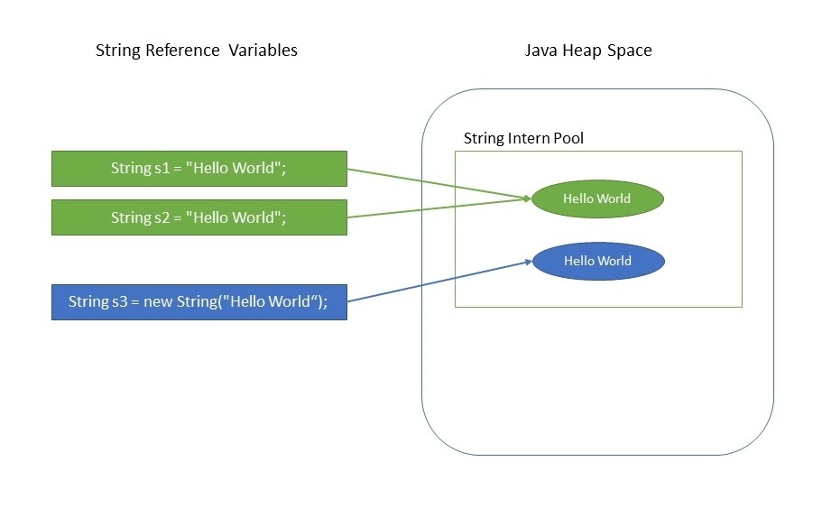

## Immutable Object là gì?
String là một tập hợp các ký tự và là kiểu dữ liệu được sử dụng rất phổ biến trong nhiều loại ngôn ngữ lập trình khác nhau. Việc xử lý chuỗi là công việc rất phổ biến trong lập trình. Tuy nhiên khác với C/C++ hay nhiều ngôn ngữ khác việc xử lý chuỗi bằng String trong java sẽ gặp nhiều bất tiện hơn bởi String trong java là một Immutable Object.
 
Một đối tượng bất biến hay Immutable Object là một đối tượng có trạng thái không đổi sau khi nó đã được tạo hoàn toàn. Tức là một khi đối tượng đã được gán cho một biến, bạn không thể cập nhật tham chiếu hoặc thay đổi trạng thái của nó nữa dẫn đến nhiều bất tiện khi xử lý biến đổi chuỗi. Sở dĩ, String trong java là một Immutable Object bởi nó được thiết kế dựa trên những tính năng mà tính bất biến cung cấp, chẳng hạn như bộ nhớ đệm (caching) và dễ dàng sử dụng lại mà không cần sao chép, bảo mật, đồng bộ hóa, hiệu năng.

## String Pool

Java sử dụng String Pool là vùng bộ nhớ đặc biệt nơi các chuỗi được lưu trữ bởi JVM.
Khi sử dụng String literals (gán giá trị chuỗi đặt trong dấu "" thay vì new String()), Chuỗi này có thể được caching và tái sử dụng lại mà không cần sao chép. Điều này sẽ tiết kiệm rất nhiều không gian bộ nhớ heap bởi vì các biến Chuỗi khác nhau tham chiếu đến cùng một đối tượng trong String pool. 
 
Khi String là bất biến trong Java, JVM tối ưu hóa bộ nhớ được cấp phát cho chúng bằng cách chỉ lưu trữ một bản sao của mỗi String trong String pool.

 

 

## Security
Tính năng tiếp theo mà String trong Java kế thừa được từ tính bất biến cung cấp đó là bảo mật.

String được sử dụng rộng rãi trong các ứng dụng Java để lưu trữ các thông tin nhạy cảm như tên người dùng, mật khẩu, connection URL, connection string, v.v. Nó cũng được sử dụng rộng rãi bởi các  JVM class loaders trong khi tải các lớp.

Nếu các String có thể thay đổi, thì vào thời điểm bạn thực hiện cập nhật, bạn không thể chắc chắn rằng String mà bạn nhận được, ngay cả sau khi thực hiện kiểm tra bảo mật, sẽ an toàn. Phương thức không đáng tin cậy vẫn có tham chiếu và có thể thay đổi String giữa các lần kiểm tra tính toàn vẹn. Do đó, làm cho truy vấn của bạn dễ bị chèn SQL injection. Vì vậy, các String có thể thay đổi có thể dẫn đến sự suy giảm bảo mật theo thời gian.

Cũng có thể xảy ra trường hợp String được hiển thị trong một luồng khác, sau đó có thể thay đổi giá trị của nó sau khi kiểm tra tính toàn vẹn.

Nói chung, tính bất biến là giải pháp của bạn trong trường hợp này bởi vì việc vận hành với mã nhạy cảm dễ dàng hơn khi các giá trị không thay đổi vì có ít thao tác xen kẽ hơn có thể ảnh hưởng đến kết quả.

## Synchronization
Khi xử lý bất đồng bộ, bạn sẽ cần rất quan tâm tới các shared resources bởi nó có thể được truy cập và thay đổi từ nhiều luồng khác nhau.

Tính bất biến làm String an toàn vì chúng sẽ không bị thay đổi khi được truy cập từ nhiều luồng khác nhau. Do đó, các đối tượng bất biến nhìn chung có thể được chia sẻ trên nhiều luồng chạy đồng thời. Chúng cũng an toàn cho luồng vì nếu một luồng thay đổi giá trị, thì thay vì sửa đổi như cũ, một String mới sẽ được tạo trong String pool. Do đó, String an toàn cho đa luồng.

## Hashcode Caching

String cũng được sử dụng rộng rãi trong các triển khai băm(hash) như HashMap, HashTable, HashSet,... Khi hoạt động dựa trên các triển khai băm này, phương thức hashCode() được gọi khá thường xuyên. Tính bất biến đảm bảo cho các String rằng giá trị của chúng sẽ không thay đổi. Vì vậy, phương thức hashCode() được ghi đè trong lớp String để tạo điều kiện cho bộ nhớ đệm, sao cho hàm băm được tính toán và lưu vào bộ nhớ cache trong lần gọi hashCode() đầu tiên và kể từ đó, giá trị tương tự được trả về. Điều này, cải thiện hiệu suất của các collections sử dụng triển khai băm khi hoạt động với các đối tượng String. Mặt khác, các String có thể thay đổi sẽ tạo ra hai mã băm khác nhau tại thời điểm chèn và truy xuất nếu nội dung của String được sửa đổi sau hoạt động, và có khả năng làm mất đối tượng giá trị trong Map.

## Performance

Cuối cùng String trong Java giúp bạn cải thiện hiệu năng. String pool tồn tại vì String là bất biến. Đổi lại, nó nâng cao hiệu suất bằng cách tiết kiệm bộ nhớ heap và truy cập nhanh hơn các triển khai băm khi hoạt động với String. Vì String là cấu trúc dữ liệu được sử dụng rộng rãi nhất, việc cải thiện hiệu suất của String có tác động đáng kể đến việc cải thiện hiệu suất của toàn bộ ứng dụng nói chung.

## Kết luận
Tại sao String trong Java là bất biến? cùng với Tại sao String trong Java là final là 2 câu hỏi phỏng vấn phổ biến nhất trong Java. String được sử dụng rất rộng rãi trong lập trình và việc bạn hiểu rõ được cách String được xây dựng và sử dụng trong Java sẽ giúp ích rất nhiều khi tiếp cận với Java.
